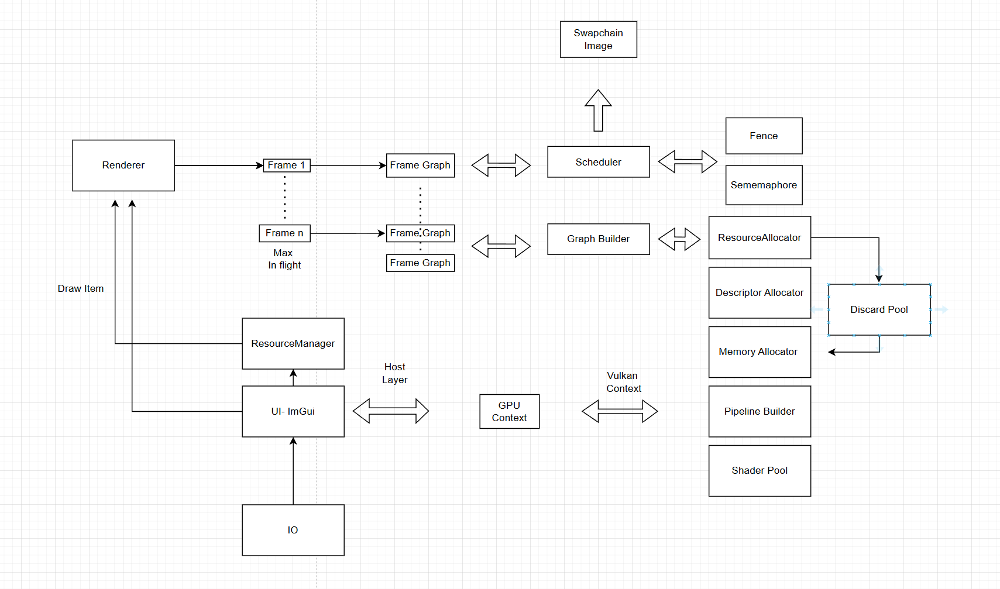
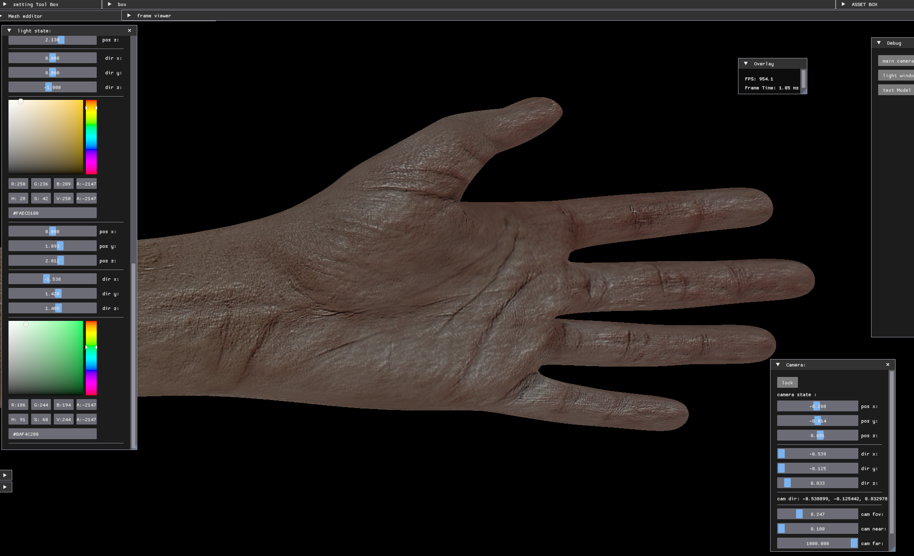
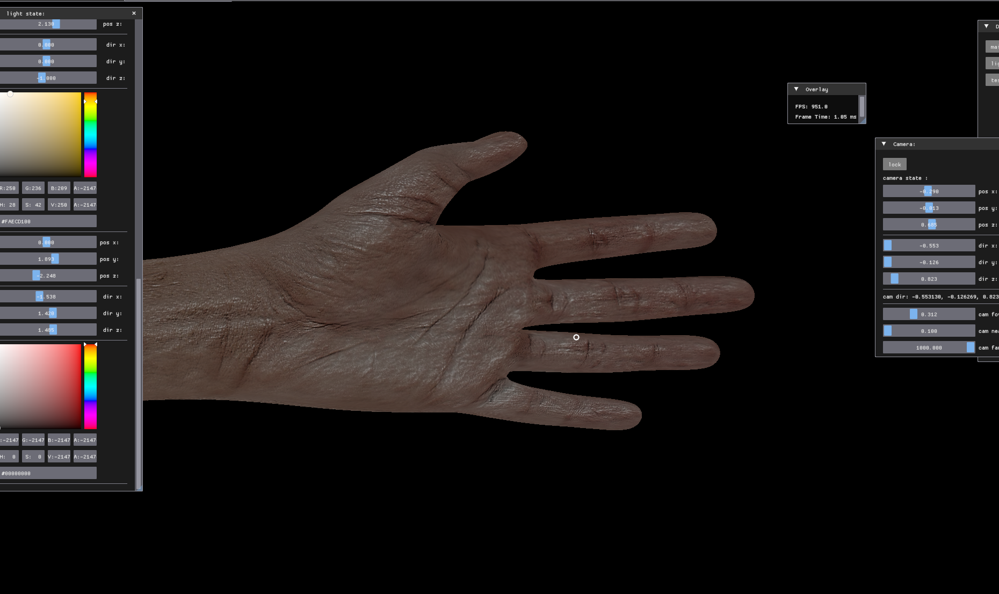
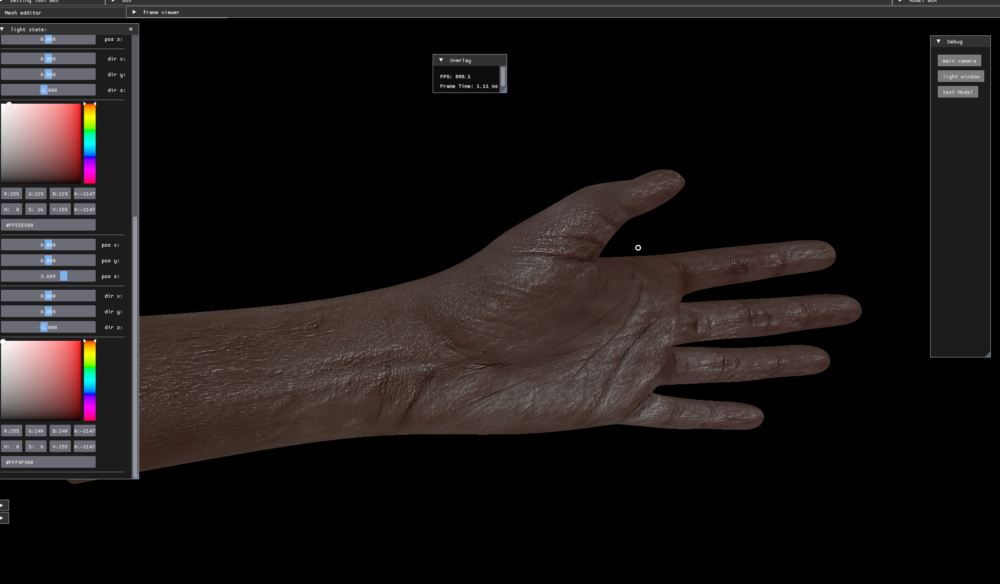
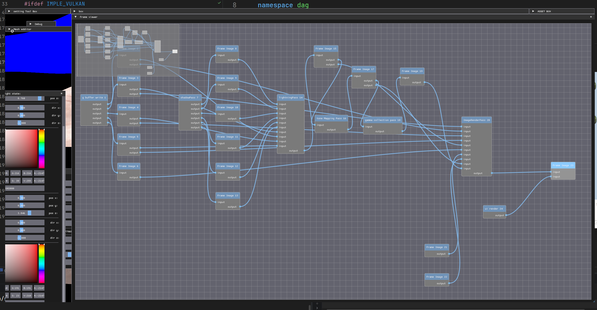
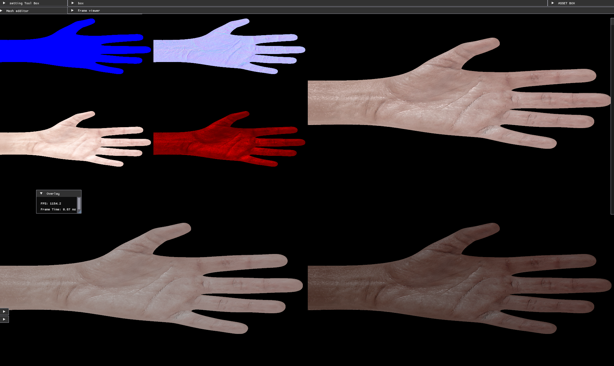

# CG-Rendering Project


**Project Overview**  
Rendering 구조와 설계를 공부하고 실험하기 위해 시작한 프로젝트입니다.

---

## ⚙️ Requirements

- **C++ Compiler:** C++17 이상 지원
- **Dependencies:**
  - CMake
  - Vulkan
  - spdlog
  - shaderc
  - KTX
  - GLFW
  - Assimp
  - ImGui
  - Spirv-reflect

---

## 🗂 Project Structure

프로젝트 구조는 다음과 같습니다:




---


# Use: Frame Graph 


# use example :

naive한 frame graph가 구현되어있습니다.
각 Frame Pass는 다음으로 graph를 build합니다.
source/core/Render  directory에서 render pass를 추가할 수 있습니다.
패스 구조는 다음과 같습니다. 
```bash
    class VkPass  {
    public:
    RenderPassType passType;
    std::vector<VkResource*> read__;
    std::vector<VkResource*> write__;
    std::function<void(VkCommandBuffer cmd)> execute = nullptr;
    struct
    {
      std::vector<VkRenderingAttachmentInfo> colorAttachment__;
      std::optional<VkRenderingAttachmentInfo> depthAttachment__;
      std::optional<VkRenderingAttachmentInfo> stencilAttachment__;
      std::optional<VkViewport> viewport__;
      VkBool32 writen__;
      VkExtent2D renderingArea{};
      VkRect2D scissor;
      VkBool32 useDepthTest;
      VkPolygonMode polygonMode = VK_POLYGON_MODE_FILL;
      PFN_vkCmdSetPolygonModeEXT vkCmdSetPolygonModeEXT;
      VkClearColorValue clearColor__;
    } passParameter__;
    .....
} 
```
각 pass parameter는 명시적으로 등록하지 않으면 이후 나중에 build하는 시점에서 resource usage에 맞춰서 자동으로 등록합니다. 
# Dependency:
- Dynamic Rendering을 사용하여 pass가 아닌 frame image단위로 의존성을 추적합니다.
- READ -> WRITE 리소스의 경우, 자동으로 resource barrier를 삽입합니다. 
- last_writer가 존재한다면,Write ->Write에 맞춰서barrier를 삽입합니다. 
- write한 리소스는 명시적으로 RenderPass가 등록되어있지 않다면, 자동으로 No Clear로 pass가 삽입됩니다.
- frame resource들은 view를 통해서 각 read,write관계를 시각화합니다.
- transfer resource는 한번만 호출된 이후 pass를 cull합니다.
- 기본적으로 frame resource로 선언된다면, device local memory를 가정합니다
- pass parameter는 frame resource의 usage flag bit에 맞춰서 등록됩니다. 
--- 


```bash
pass->read__.push_back(renderTargetFilm_->what_need_to_read_target.get());
    pass->write__.push_back(renderTargetFilm_->what_need_to_write_target.get());
    pass->execute = [this, pass](gpu::CommandBuffer cmd)
    {
      //실행할 내용을 lambda내에서 선언하면, graph에 barrier삽입을 하고 프레임 리소스를 할당하여, graph 를 build합니다.
      //이후 순차적으로 선언된 pass를 돌아가면서 각 commandbuffer에 삽입한 후, 실행합니다. 
    };
    uploadPasses_.push_back(pass);
  }

```
frame resource로 선언된 경우, graph가 빌드할 타이밍에 gpu physical resource를 할당합니다. 
이전까지는 resource 메모리가 할당되어있지않습니다. 
```bash
    addGBufferWritePass();
    addShadowPass();
    addLightningPass();
    addTonemapPass();
    addGammaCorrectionPass();
    offscreenRenderPass();
    renderPasses_ = gpu::ctx__->pGraphBuilder->build(uploadPasses_, frameIndex_);
// 모든 pass가 선언된 이후, graph builder를 호출하여 실제 graph를 생성할 수 있습니다. 
```


model import example : 
```bash
  //engine.cpp 코드에서 필요한 model을 import할 수 있습니다. 
  ///필요한 model 및 텍스쳐를 내부에서 코드로 올리면, 모델을 불러울 수 있습니다.
  std::string test = "assets/textures/HAND_C.jpg";
  std::string test2 = "assets/textures/HAND_N .jpg";
  std::string test3 = "assets/textures/HAND_S.jpg";
  resourceManager.uploadTexture(test);
  resourceManager.uploadTexture(test2);
  resourceManager.uploadTexture(test3);
  resourceManager.uploadMesh("assets/models/hand.fbx");
  auto& mesh = resourceManager.meshes_["assets/models/hand.fbx"];
  resourceManager.addModel(mesh.get(), "test Model");
  auto& modle = resourceManager.models_["test Model"];
  modle->constant.albedoTextureIndex = resourceManager.textures_[test]->descriptorArrayIndex__;
  modle->constant.normalTextureIndex = resourceManager.textures_[test2]->descriptorArrayIndex__;
  modle->constant.roughnessTextureIndex = resourceManager.textures_[test3]->descriptorArrayIndex__;
```


## 🚀 Project Results

<div align="center">





Frame View : 

MRT:

</div>

## 📌 Notes

- Vulkan 기반 Rendering 구조 실험 중심 프로젝트
- 학습 목적이며, 구조 이해 및 실습 위주로 구현
- 향후 최적화 및 다양한 그래픽 기능 확장 계획


