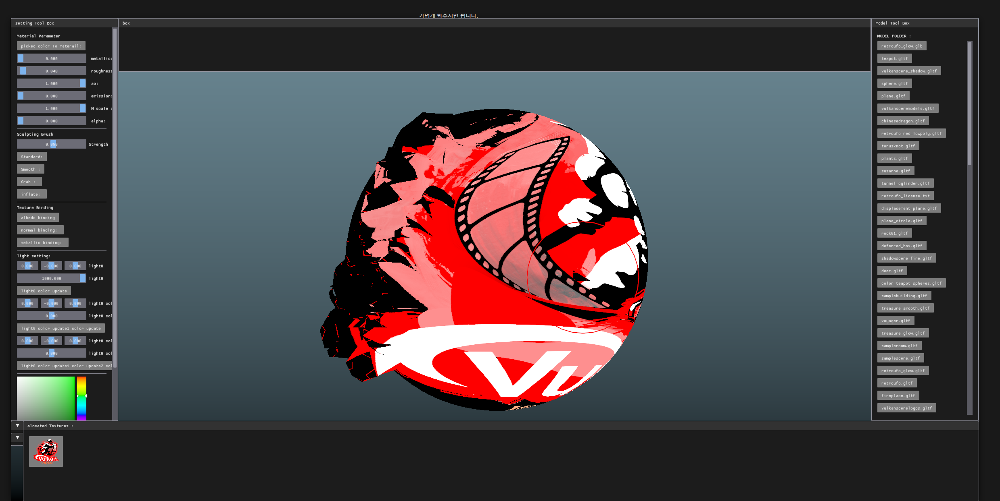
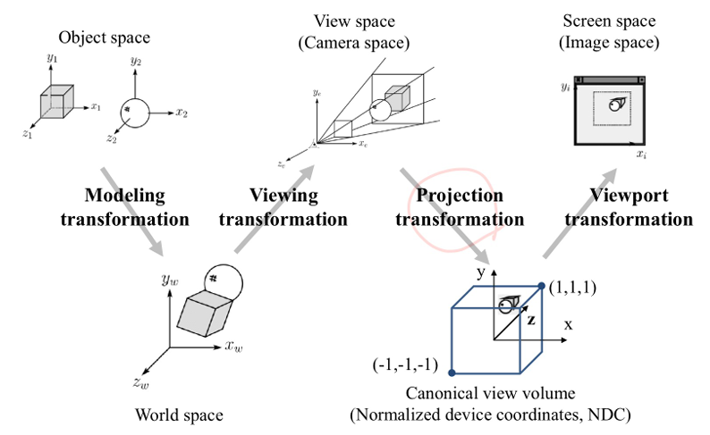
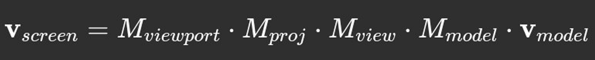

# CG-Sculpting App Project

**Project Overview**  
예전에 조각을 전공했던 적이 있어, 디지털 조각프로그램을
구현해보고자 시작한 프로젝트입니다.

---

## ⚙️ Requirements

- **C++ Compiler:** C++17 이상 지원
- vcpkg를 통해서 아래 dependency를 받아야합니다. 
- **Dependencies:**
  - CMake
  - Vulkan
  - spdlog
  - shaderc
  - KTX
  - GLFW
  - Assimp
  - ImGui
  - Spirv-reflect
  - CMake를 build하여 시작할 수 있습니다.
---

## Build
mkdir build

cd build

cmake ..

cmake --build . 

---
## 🚀 Project Results
모델 매쉬를 불러와서, sculpting 및 간단한 texture, lighting이 가능합니다.
key 조작은 다음과 같습니다. 

F, LEFT_CRTL : model rotate 

left mouse click : drawing 

F, LEFT_CRTL : view 초기화

G: smooth 

LEFT_ALT : strength 조정

S: symmetry Toggle 

LEFT_SHIFT + mouse left : model scaling 

mouse middle : model move 

LEFT_CRTL + mouse right: brush size 조정

---
## 🗂 Project Implemation: 
viewing pipeline :

Click Event  come
from
View port

## Ndc x = ((x+0.5)/extent_w)*2 -1

## Ndc y = 1-((y+0.5)/extent_h)*2

z-buffer: 
모델 행렬은 vertex shader에서
곱해지므로,

z buffer 재사용을 위해서 카메라
메트릭스를 조작하지 않습니다.

## Ndc To World Space

## Ndc Point: vec3(ndc X, ndc Y, depth Buffer Z, 1.0)

# brush: 

---

[ Reference ]

Computer Graphics with OpenGL 4th edition, Hearn, Baker

